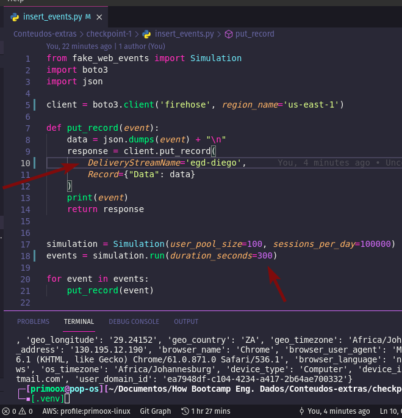
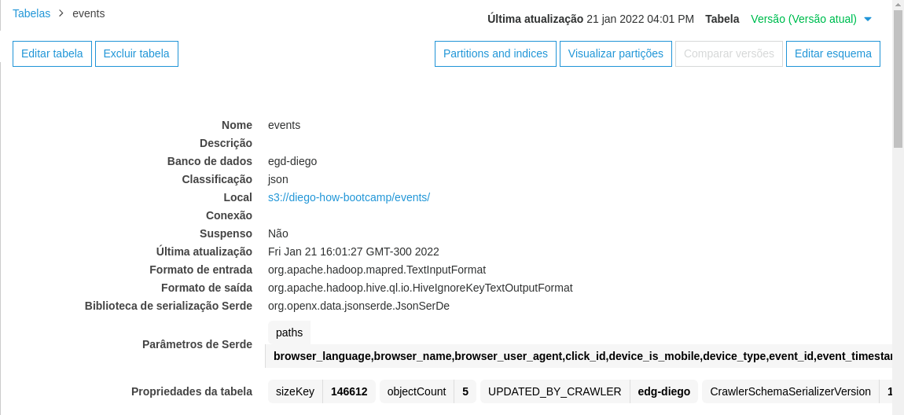

# Streaming de Dados com Kinesis Firehose

Exemplo de projeto que faz a geração e ingestão de dados em tempo real para o Kinesis Firehose, salvando os arquivos em um bucket do S3.  
Utilizamos a biblioteca [fake_web_events](https://github.com/andresionek91/fake-web-events) para gerar eventos aleatórios em tempo real e o [boto3](https://boto3.amazonaws.com/v1/documentation/api/latest/index.html) para se comunicar com os serviços da AWS.  
Após a ingestão também podemos utilizar o Glue para crawlear os dados e gerar os schemas dos eventos e então utilizar o Athena para analisar os dados diretamente da AWS.

# Configurando Recursos na AWS

1. Criar um bucket no S3:
   - Deixar com acesso público
   - Habilitar versionamento
   - Habilitar criptografia (SSE-S3)  

2. Criar um Delivery Stream no Kinesis Firehose:
   - Delivery Stream Name: `[name]`
   - Source: Direct PUT
   - Destination: Amazon S3
   - S3 bucket: `[path-of-bucket-created]`
   - S3 bucket prefix: `events/landing-date=!{timestamp:yyyy}-!{timestamp:MM}-!{timestamp:dd}/`
   - S3 bucket error output prefix: error
   - Buffer size: 1
   - Buffer interval: 60
   - Compression: GZIP  

3. Execução do código Python:  
   - Configure o Kinesis Stream Name e o tempo (em segundos) para gerar os eventos.
   - Ao executar o código, os eventos começam a ser gerados e ingeridos pelo Kinesis Firehose, que irá enviá-los para o S3.

  

4. AWS Glue Crawler:  
   - Crie um crawler para ser executado sob demanda.
   - Crie uma IAM role com as permissões necessárias caso não exista.
   - Habilite a opção para atualizar todas partições novas e existentes com os metadados da tabela.
   - Após rodar o crawler, o Glue irá criar um schema para cada evento, que pode ser utilizado para analisar os dados diretamente da AWS com o Athena.

  

